# 💫 Hi, I am Ivan

🔭 I’m currently building a **GitHub App** for automating FinTech code compliance checks as part of the Elasticsearch Agent Builder hackathon.  
🌱 Deepening my knowledge in **System Design**, **Microservices**, and **Distributed Consensus**.  
🤖 Exploring **Generative AI** (LLMs & RAG) to build intelligent, autonomous agents.  
💼 Open to **Fullstack** or **Backend** opportunities (Go, Rust, TypeScript).

---

### 🛠 Tech Stack

| Domain | Technologies |
| :--- | :--- |
| **Backend** |    |
| **Systems** |      |
| **AI & Agents** |    |
| **Frontend** |    |
| **Cloud & Infra** |      |
---

### 📊 Stats

---

 
